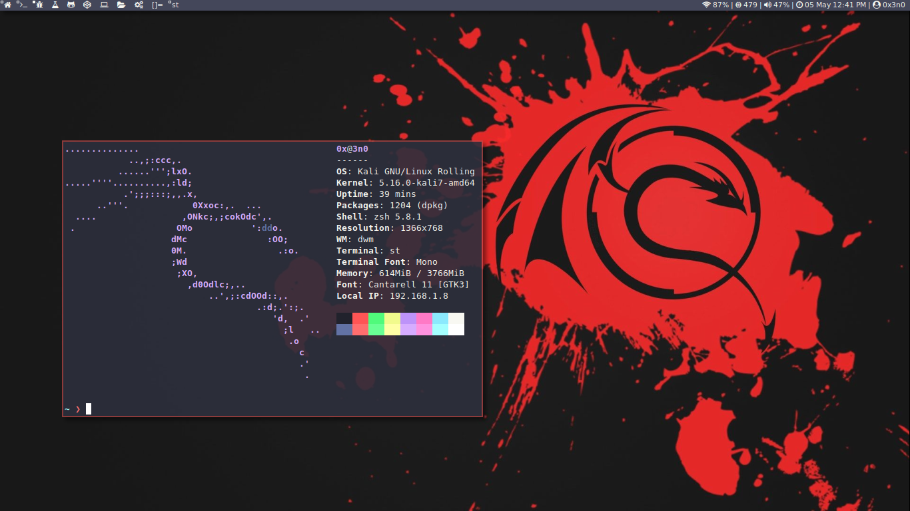
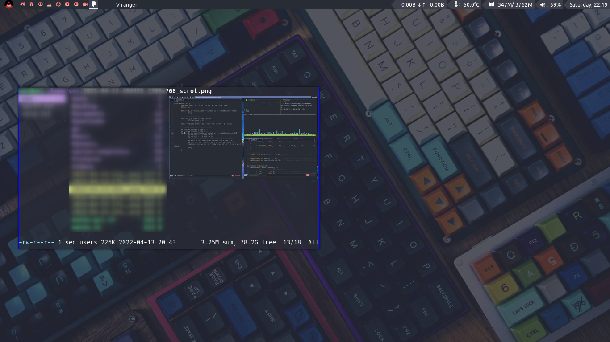
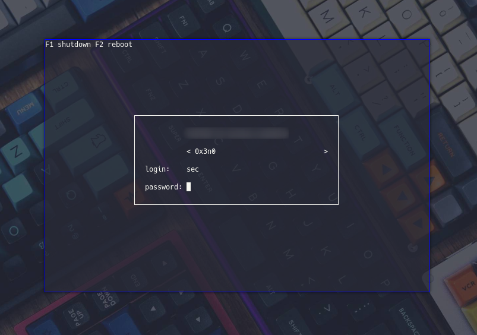
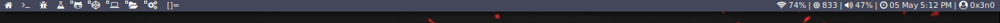
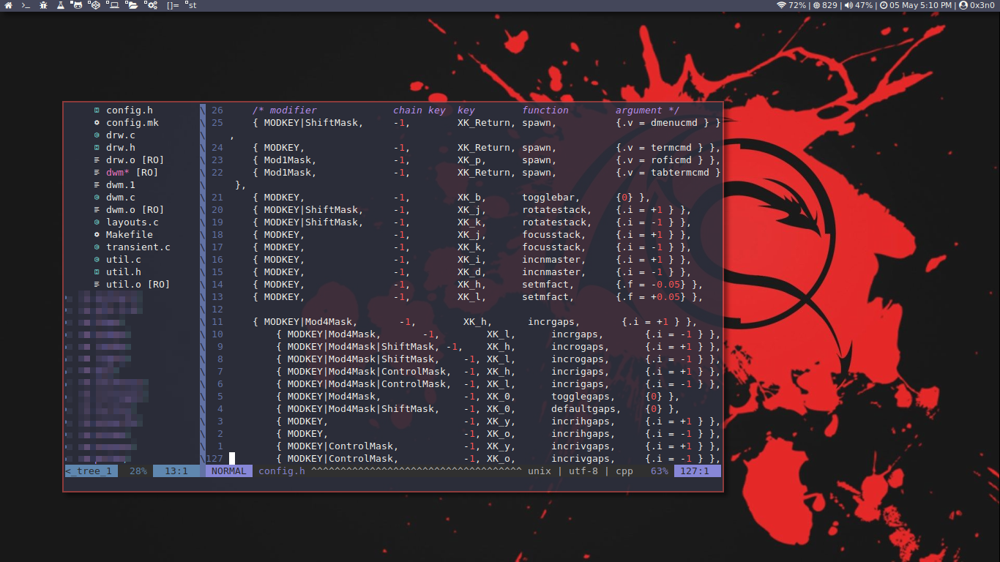

## Dwm in Arch linux

## dwm in debian kali linux

## Qtile

## ly display manager


## Keybindings
These are the keybindings for qtile and dwm

| A FEW IMPORTANT KEYBINDINGS | ASSOCIATED ACTION                                                        |
|:--|:--
| MODKEY + RETURN             | opens terminal (alacritty is the terminal but can be easily changed)     |
| MODKEY + SHIFT + RETURN     | opens run launcher (dmenu is the run launcher but can be easily changed) |
| MODKEY + TAB                | rotates through the available layouts                                    |
| MODKEY + SHIFT + c          | closes window with focus                                                 |
| MODKEY + SHIFT + r          | restarts qtile                                                           |
| MODKEY + SHIFT + q          | quits qtile                                                              |
| MODKEY + 1-9                | switch focus to workspace (1-9)                                          |
| MODKEY + SHIFT + 1-9        | send focused window to workspace (1-9)                                   |
| MODKEY + j                  | lazy layout down (switches focus between windows in the stack)           |
| MODKEY + k                  | lazy layout up (switches focus between windows in the stack)             |
| MODKEY + SHIFT + j          | lazy layout shuffle_down (rotates the windows in the stack)              |
| MODKEY + SHIFT + k          | lazy layout shuffle_up (rotates the windows in the stack)                |
| MODKEY + h                  | shrink size of window (MondadTall layout)                                |
| MODKEY + l                  | expand size of window (MondadTall layout)                                |
| MODKEY + w                  | switch focus to monitor 1                                                |
| MODKEY + e                  | switch focus to monitor 2                                                |
| MODKEY + r                  | switch focus to monitor 3                                                |
| MODKEY + period             | switch focus to next monitor                                             |
| MODKEY + comma              | switch focus to prev monitor                                             |

### Open apps

| Keybinding       | Action                                                                       |
|:--|:--
| MODKEY + ALT + b | open Chromium browser                                                        |
| MODKEY + ALT + s | tabbed -r 2 surf  duckduckgo.com/?q="'                                       |
| MODKEY + ALT + b | open telegeam                                                                |
| MODKEY + ALT + f | open [pcmanfm (PaCMANFileManager)](https://wiki.archlinux.org/title/PCManFM) |
| MODKEY + ALT + i | open instagram.com |
| MODKEY + ALT + l | open linkedin.com |
| MODKEY + ALT + t | open twitter.com |

#### Keybinding to open apps using `SUPER` + `ALT` + `key`
```plaintext
{ MODKEY|Mod1Mask,      -1,        XK_g,      spawn,          CMD("surf google.com") },
{ MODKEY|Mod1Mask,      -1,        XK_m,      spawn,          CMD("tabbed -r 2 surf  duckduckgo.com/?q=") },
{ MODKEY|Mod1Mask,      -1,        XK_l,      spawn,          CMD("surf linkedin.com") },
{ MODKEY|Mod1Mask,      -1,        XK_i,      spawn,          CMD("surf instgaram.com") },
{ MODKEY|Mod1Mask,      -1,        XK_w,      spawn,          CMD("surf web.whatsapp.com") },
{ MODKEY|Mod1Mask,      -1,        XK_t,      spawn,          CMD("surf twitter.com") },
{ MODKEY|Mod1Mask,      -1,        XK_b,      spawn,          CMD("chromium") },
{ MODKEY|Mod1Mask,      -1,        XK_c,      spawn,          CMD("telegram-desktop") },
{ MODKEY|Mod1Mask,      -1,        XK_f,      spawn,          CMD("pcmanfm") },
```


| Details                     |                   |
|:--|:--
| operating system            | Arch Linux        |
| Display manager             | Ly manager        |
| Terminal                    | ST and alacritty  |
| WM                          | Qtile and DWM     |

## Installation DWM
directly to the .config/dwm directory file and then compile
```bash
sudo make clean install
```

## Installation dwmblocks


go to dwmblocks directory `.config//dwm/dwmblocks`
```bash
sudo make clean install
```
### Installataion Vim



Download config file with:
```bash
curl -fLo ~/.vimrc --create-dirs https://raw.githubusercontent.com/0x3n0/dotfiles/main/.vimrc
```

Install `vim-plug` (for plugin management) with:

```bash
curl -fLo ~/.vim/autoload/plug.vim --create-dirs https://gist.githubusercontent.com/0x3n0/c19a090df08c999a516a4e950f50d12d/raw/24c69c17f2baff032af9d8efc0f0eb999f28f376/plug.vim
```
Run Vim and install plugins with `:PlugInstall`. Exit and restart for changes to take effect.

and reuse the Vim config files by adding these lines to `~/.config/vim/init.vim`, as described in Transitioning from Vim:

```bash
set runtimepath^=~/.vim runtimepath+=~/.vim/after
let &packpath=&runtimepath
source ~/.vimrc
```

## Qtile
if you want to use qtile, install qtile by typing command line

```bash
sudo pacman -S qtile
```
then create a ```qtile.desktop``` file in the directory `/usr/share/xssesions` it applies if you use ly manager if you don't use `ly display manager` please find out for yourself

```bash
[Desktop Entry]
Name=0x3n0
Comment=Qtile Session
Exec=qtile start
Type=Application
Keywords=wm;tiling
```

### touchpad.conf
Swapping two- and three-finger tap for a touchpad is a straight forward example. Instead of the default three-finger tap for pasting you can configure two-finger tap pasting by setting the `TappingButtonMap` option in your Xorg configuration file. To set 1/2/3-finger taps to left/right/middle set `TappingButtonMap` to `lrm`, for left/middle/right set it to `lmr`.

create a file name `30-touchpad.conf` under the directory `xorg.conf.d`

```plaintext
/etc/X11/xorg.conf.d/30-touchpad.conf
```

copy and paste this configuration then save

```bash
Section "InputClass"
    Identifier "touchpad"
    Driver "libinput"
    MatchIsTouchpad "on"
    Option "Tapping" "on"
    Option "TappingButtonMap" "lmr"
EndSection
```

or you can use this and name it `90-touchpad.conf`

```bash
Section "InputClass"
    Identifier "Touchpad"
    Driver "libinput"
    MatchIsTouchpad "on"
    Option "Tapping" "on"
    Option "TappingButtonMap" "lrm"
    Option "NaturalScrolling" "true"
    Option "AccelSpeed" "0.45"
    Option "CursorSize" "12"
EndSection

```

### Package
+ `libxft-bgra`
+ `st`
+ `dmenu`
+ `rofi`
+ `feh`
+ `nitrogen`
+ `ranger`
+ `ttf-mono`
+ `ttf-nerd-font`
+ `ttf-joypixels`
+ `alacritty`
+ `dwmblocks`
+ `starship`

